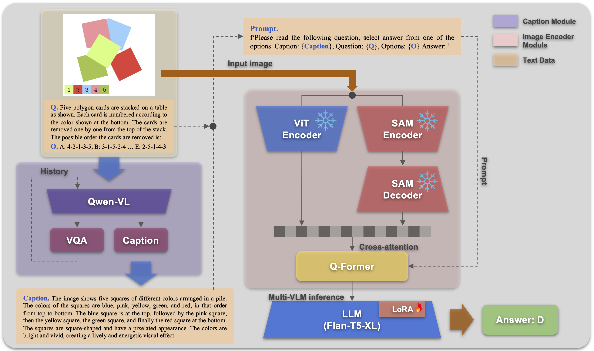
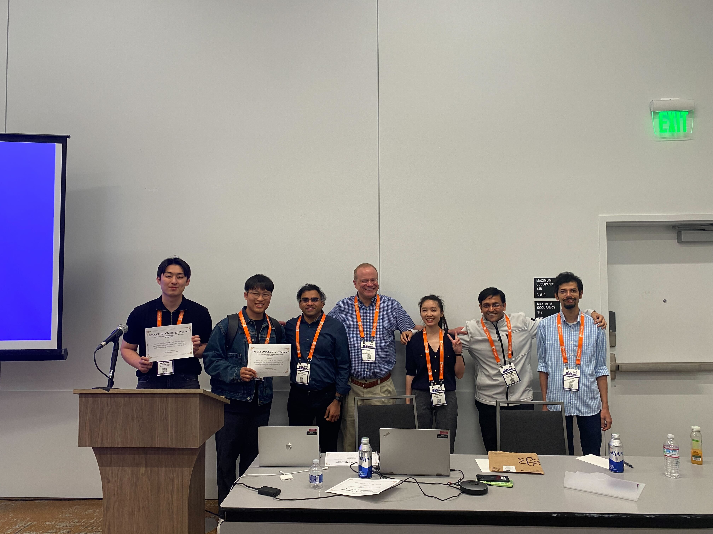

# SMART CHALLENGE 2024 CVPR MAR WORKSHOP
MLP version of **HYU_MLLAB_KT** Team's SMART-101 CVPR 2024 Challenge.          

All codes were developed based on the challenge starter code and are organized in this repository for future research and backup.
Our research focuses on enhancing the mathematical and theoretical capabilities of the model, InstructBLIP-Flant5.
The two main contributions are: first, to strengthen the text information by generating separate captions for the puzzles and performing prompt engineering.
Second, to utilize the image encoder part of SAM to extract superior visual features considering the characteristics and specificity of the puzzle images.
The technical report and paper can be found at the link below. Thank you. https://arxiv.org/abs/2406.05963

# Architecture

# Reward

# Reference Link
- Official Challenge Github: https://github.com/wasabipretzel/SMART_mllab
- Challenge Paper Link: https://arxiv.org/abs/2406.05963
- Challenge Website: https://eval.ai/web/challenges/challenge-page/2247/overview
- MAR2024: https://marworkshop.github.io/cvpr24/
